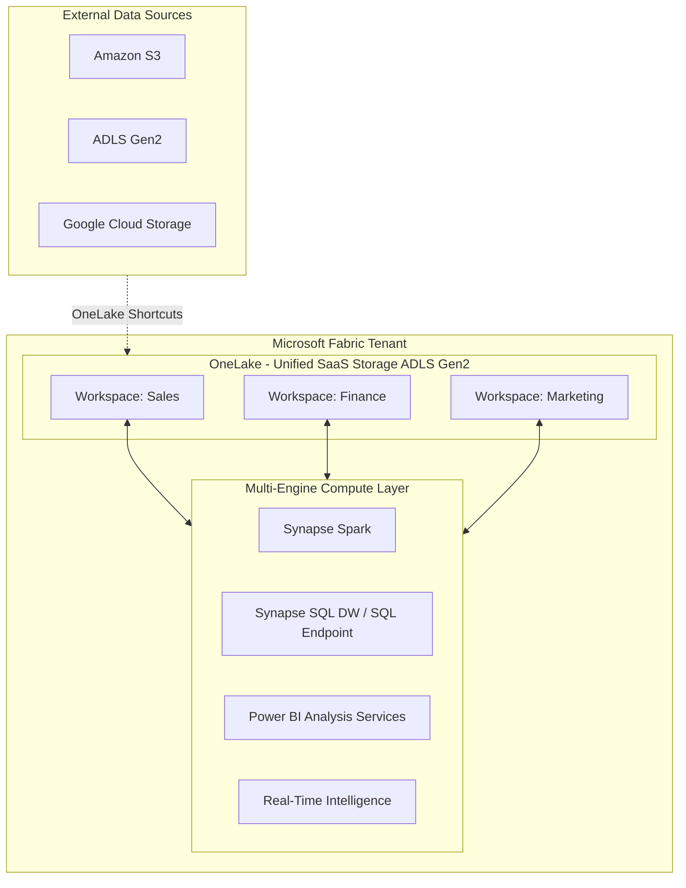
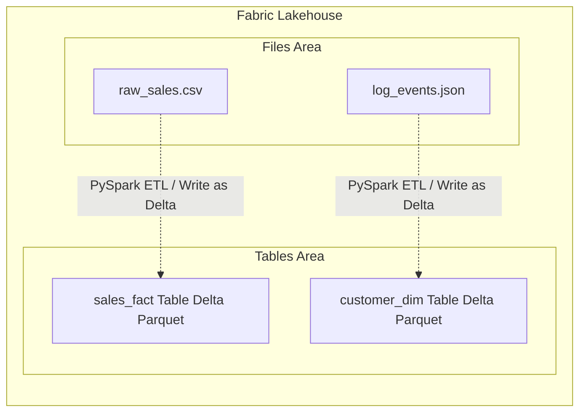
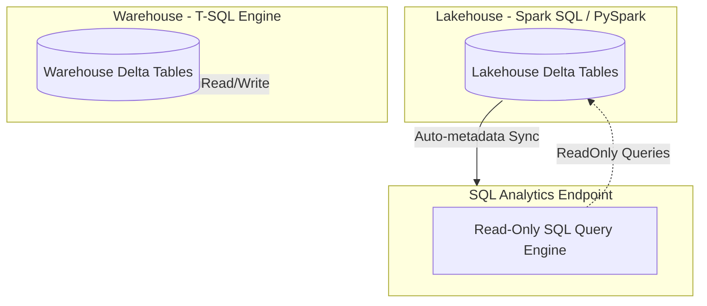
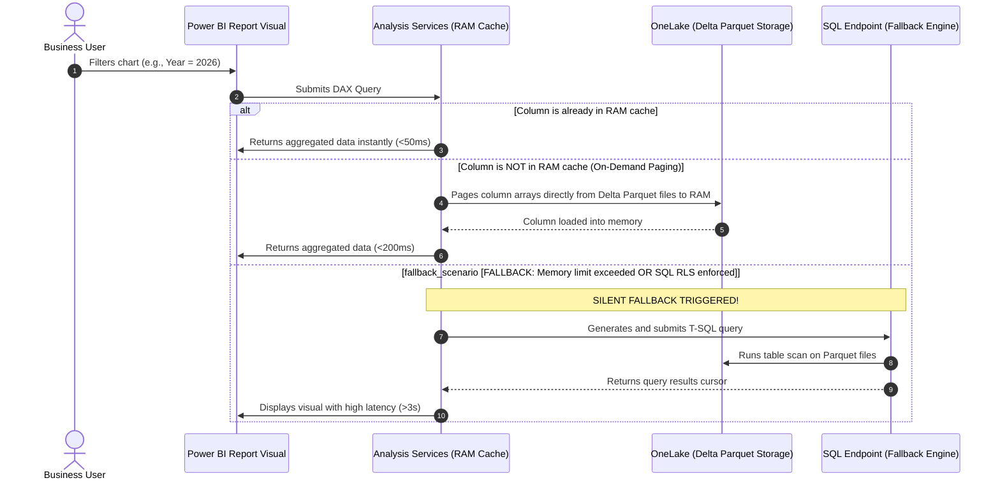
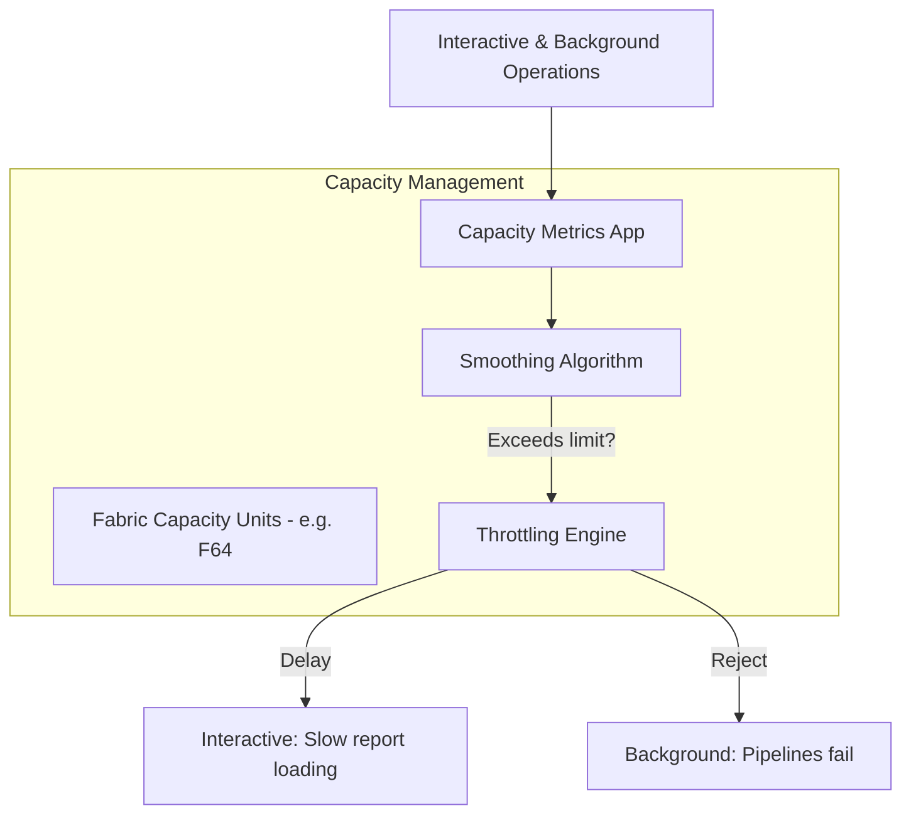

# DP-600 Fabric Analytics Engineer Study Companion Notebook
[](https://learn.microsoft.com/en-us/fabric/)
[](https://learn.microsoft.com/en-us/credentials/certifications/exams/dp-600/)
[](./dp600_study_companion.ipynb)

Welcome to the ultimate **DP-600 study companion and production reference guide** for Microsoft Fabric Analytics Engineers. This repository contains a comprehensive study notebook, architectural cheat sheets, detailed diagrams, and exam guides covering everything you need to pass the **DP-600: Implementing Analytics Solutions Using Microsoft Fabric** exam on your first attempt.

## 📖 What is Microsoft Fabric?
Microsoft Fabric is a unified, SaaS-based enterprise data platform that consolidates data engineering, data warehousing, real-time intelligence, data science, and business intelligence. By storing all structured and unstructured data in open-source **Delta Parquet** format within a single logical lakehouse called **OneLake**, Fabric eliminates the "Data Copy Tax" and allows multiple specialized compute engines to query the same copy of data concurrently.

---

## 🗺️ Repository Structure
```
├── README.md                              # Premium repository overview and guide
├── dp600_study_companion.ipynb            # Jupyter Notebook with Markdown notes + code cells (PySpark, SQL, DAX)
├── study_notes.md                         # Focused exam cheat sheet and quick reference
└── images/
    └── dp-600-fabric-analytics-engineer-study-companion-notebook.webp  # Featured repository image
```

---

## 🔍 Core Fabric Pillars Covered

### 1. OneLake Fundamentals & SaaS Architecture
OneLake is the unified data lake for the entire tenant. It operates hierarchically (Tenant -> Workspaces -> Items).
- **Single Copy Concept**: Write once, read by all compute engines.
- **Shortcuts**: Virtual files pointing to other storage locations (external ADLS Gen2, Amazon S3, Google Cloud, or other Fabric workspaces) without data duplication.
- **Domains & Governance**: Delegating administrative boundaries (Contributors, Admins) to logical business domains.



---

### 2. Lakehouse Architecture & Medallion Patterns
A Fabric Lakehouse divides OneLake into two primary folders:
- **Files**: Unstructured landing zones for raw files (CSV, JSON, XML, images).
- **Tables**: Managed tables stored in Delta Parquet format, automatically registered in the Fabric Metastore.

#### Medallion Flow:
- **Bronze (Raw)**: Raw files. Append-only, partitioned by date.
- **Silver (Cleaned)**: Cleansed, enriched, de-duplicated data. Stored as Delta tables.
- **Gold (Curated)**: Aggregated star schemas ready for reporting. Optimized with V-Order and Z-Order.



---

### 3. Data Warehouse Architecture
Fabric Warehouse is a fully relational, ACID-compliant database engine that relies entirely on a SQL query engine (Polaris) to run DDL/DML. 
Every Lakehouse automatically exposes a read-only **SQL Analytics Endpoint**.



#### Decision Matrix:
- Use **Lakehouse (SQL Endpoint)** if you primarily work with Spark, Python, and only need read-only SQL querying.
- Use **Data Warehouse** if you need full relational T-SQL capabilities (`INSERT`, `UPDATE`, `DELETE`, `MERGE`), multi-table transactions, and database-level security.

---

### 4. Direct Lake Mode & Fallback Analysis
Direct Lake is a revolutionary Power BI connection mode that pages columnar arrays of Delta Parquet files directly from OneLake into the Analysis Services RAM cache on-demand, bypassing the SQL engine.

#### Direct Lake Fallback Scenario:
If memory capacity boundaries are exceeded or database-level security policies (like RLS/OLS in the database engine instead of the Semantic Model) are enforced, the query engine silently falls back to **DirectQuery mode**, which introduces query latency.



---

### 5. DAX Optimization & Context Transitions
Mastering DAX calculations is a core component of the DP-600.
- **CALCULATE**: Evaluates expressions in a modified filter context.
- **FILTER**: Iterates over tables; avoid passing large physical tables directly to improve performance.
- **Context Transition**: The process where a row context is converted into a filter context (triggered by calling a measure inside an iterator or using an explicit `CALCULATE` call).

---

### 6. Security, Governance & Capacity Monitoring
- **Workspace Roles**: Admin, Member, Contributor (ideal for developers), Viewer (cannot read raw tables directly).
- **Lineage & Endorsements**: Track upstream dependencies and label quality with `Promoted` or `Certified`.
- **Capacity Monitoring**: Monitor interactive and background operations, understanding capacity smoothing (24-hour window for background operations, 10-minute window for interactive operations) to prevent progressive throttling.



---

## 🚀 How to Use the Jupyter Notebook
The [dp600_study_companion.ipynb](./dp600_study_companion.ipynb) notebook is designed to be opened in any Jupyter environment, VS Code, Azure Data Studio, or uploaded directly into a Microsoft Fabric Spark Workspace.

1. **Spark ETL Cells**: Contain runnable Python code demonstrating how to build a medallion model and run V-Order optimization on Spark tables.
2. **Warehouse SQL Cells**: Contain T-SQL scripts for creating schemas, collecting statistics, and querying Delta tables.
3. **DAX Reference Cells**: Detail semantic calculations and demonstrate context transition traps.

---

## 📖 Additional Resources
- Read the detailed study guide [study_notes.md](./study_notes.md).
- Access the [Official Microsoft DP-600 Exam Page](https://learn.microsoft.com/en-us/credentials/certifications/exams/dp-600).
- Practice with [Microsoft Learn DP-600 Study Path](https://learn.microsoft.com/en-us/training/paths/perform-data-engineering-microsoft-fabric/).

## 👨‍💻 Community & Contributions
If you find this repository useful, feel free to **Star** it and share your own study strategies or pull requests with improvements. Happy learning and good luck with your DP-600 Microsoft Fabric Analytics Engineer certification!
