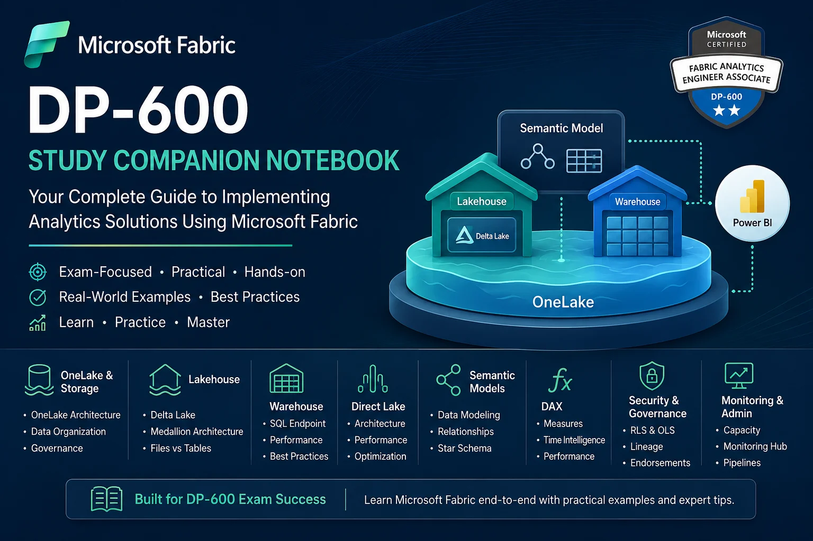

# DP-600 Study Companion Notebook for Microsoft Fabric




A practical study companion for professionals preparing for the DP-600: Implementing Analytics Solutions Using Microsoft Fabric certification.

This repository combines exam preparation notes, architecture diagrams, implementation guidance, and hands-on notebook examples covering the most important Microsoft Fabric concepts for Analytics Engineers.

## Last Updated

* **Last Updated**: June 2026
* **DP-600 Skills Measured Alignment**: Current

## About This Repository

As a Business Intelligence and Analytics professional working with Power BI, SQL, Azure, and Microsoft Fabric, I created this repository to consolidate the key topics required for DP-600 certification into a single, easy-to-reference resource.

The content focuses on practical understanding rather than memorization and is designed to help candidates understand how Microsoft Fabric components work together in real-world analytics solutions.

## Topics Covered

### OneLake

* OneLake architecture
* Data organization strategies
* Shortcuts
* Workspace and domain concepts

### Lakehouse

* Delta tables
* Files and Tables
* Medallion architecture
* Data preparation patterns

### Data Warehouse

* Warehouse architecture
* SQL Analytics Endpoint
* T-SQL implementation patterns
* Lakehouse vs Warehouse decision framework

### Semantic Models

* Star schema design
* Relationships
* Measures and DAX
* Model optimization

### Direct Lake

* Direct Lake architecture
* DirectQuery vs Import vs Direct Lake
* Performance considerations
* Fallback scenarios

### Security & Governance

* Workspace roles
* Row-Level Security (RLS)
* Object-Level Security (OLS)
* Data lineage
* Endorsements

### Monitoring & Administration

* Monitoring Hub
* Capacity management
* Deployment pipelines
* Governance best practices

## Repository Contents

```text
dp600-study-companion-notebook/
│
├── README.md
├── dp600_study_companion.ipynb
├── study_notes.md
└── images/
```

## Who Should Use This Repository?

* DP-600 certification candidates
* Microsoft Fabric Analytics Engineers
* Power BI Developers
* Data Analysts
* BI Architects
* Data Platform Professionals

## Learning Resources

* [Microsoft Learn DP-600 Learning Path](https://learn.microsoft.com/en-us/training/paths/perform-data-engineering-microsoft-fabric/)
* [Microsoft Fabric Documentation](https://learn.microsoft.com/en-us/fabric/)
* [Practice Assessments](https://learn.microsoft.com/en-us/credentials/certifications/exams/dp-600/)
* [Hands-on Fabric Labs](https://microsoftlearning.github.io/mslearn-fabric/)

## Contributing

Suggestions, corrections, and improvements are welcome. If you find this repository useful, consider starring the project and sharing it with other Microsoft Fabric learners.

## Author

**Datta Sable**

Senior MIS & Business Intelligence Manager

Power BI | Microsoft Fabric | SQL | Python | Data Analytics | Reporting Automation

* **LinkedIn**: [https://linkedin.com/in/dattasable](https://linkedin.com/in/dattasable)
* **Website**: [https://dattasable.com](https://dattasable.com)
